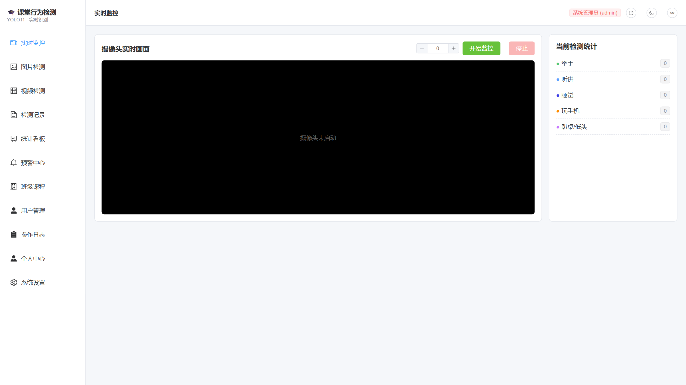
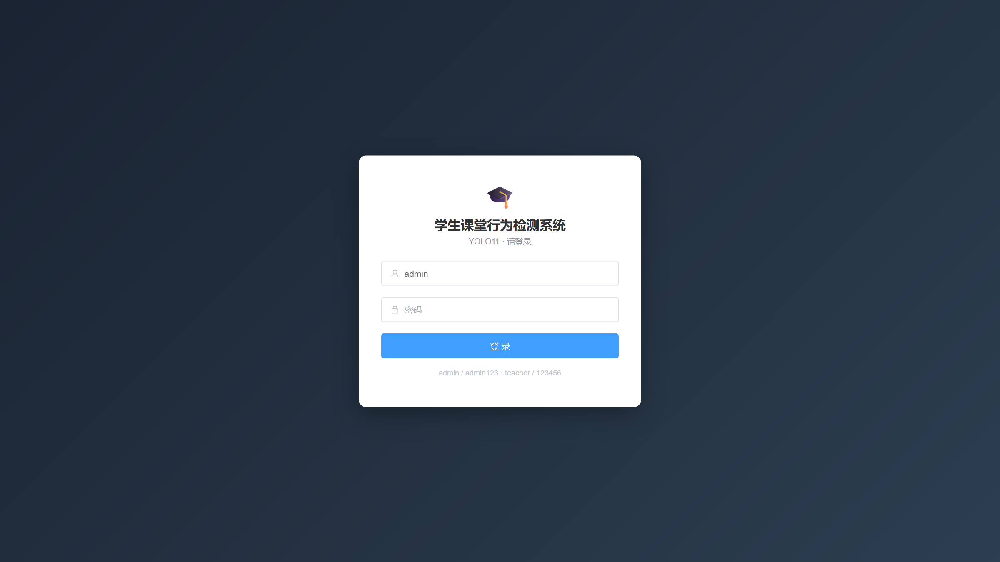
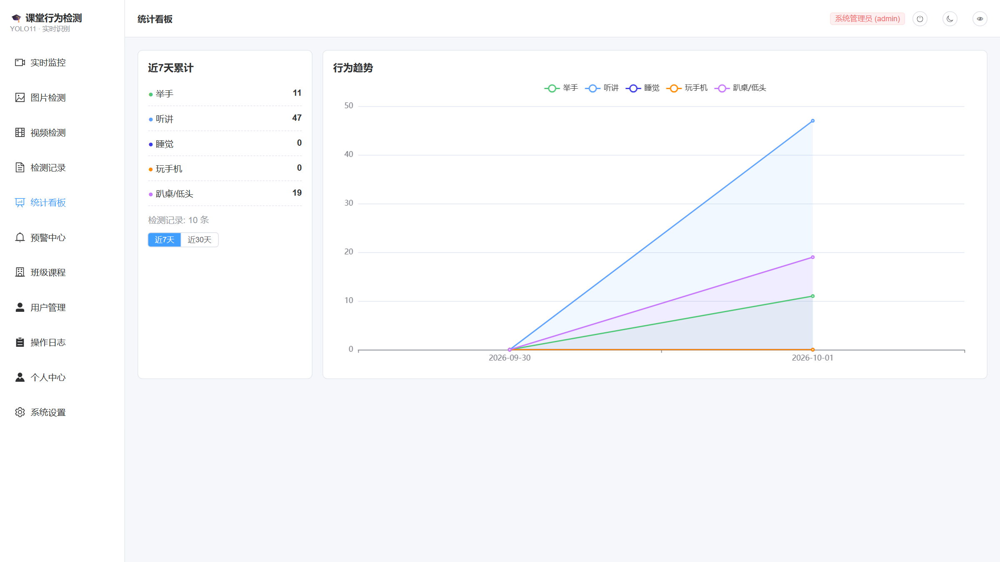
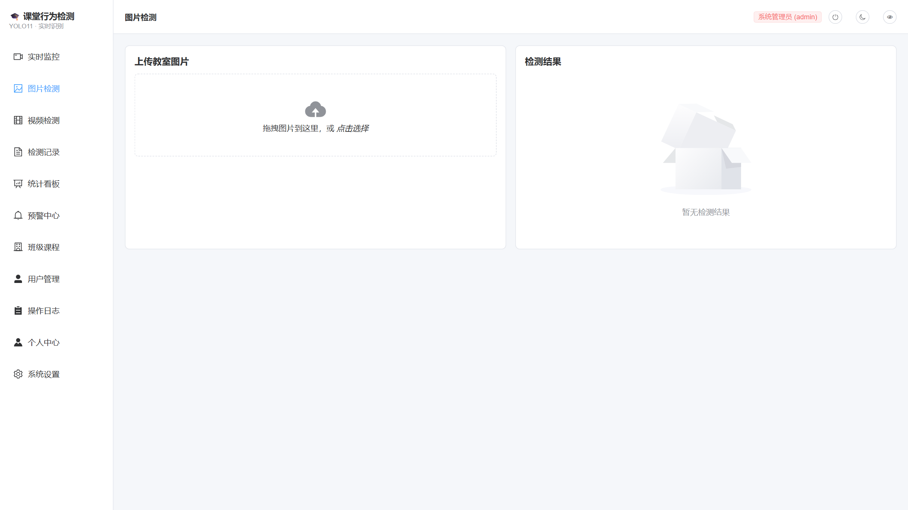
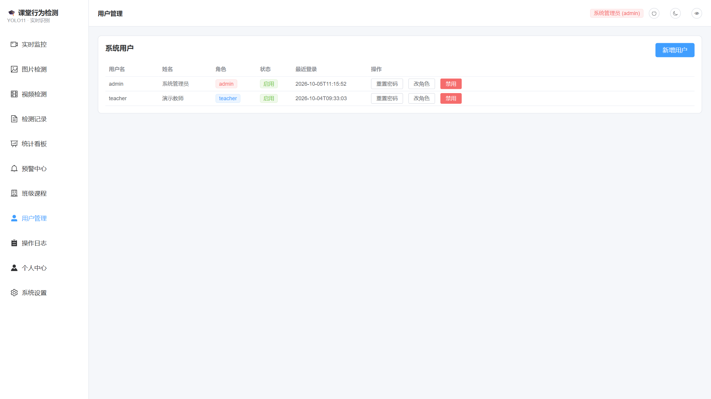
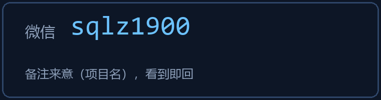

# 🎓 学生课堂行为检测系统

> 基于 **YOLO11 + Vue3 + SpringBoot + Flask** 的完整课堂行为分析系统
> 图片 / 视频 / 摄像头三路实时检测 · 异常行为自动预警 · 完整 RBAC 权限

[]()
[]()
[]()
[]()
[]()



## ✨ 功能总览

| 功能 | 说明 |
|---|---|
| 🖼️ 图片检测 | 上传教室照片，返回标注图 + 五类行为计数 + 逐框置信度 |
| 🎬 视频检测 | 异步任务 10fps 抽帧推理，输出标注视频与统计 |
| 📹 摄像头实时 | MJPEG 推流逐帧检测，睡觉/玩手机/趴桌自动触发预警 |
| 🔔 预警中心 | 异常行为落库 + 确认处理流程 |
| 📊 统计看板 | ECharts 行为趋势图，按天聚合 |
| 👥 RBAC 权限 | JWT 登录 + admin/teacher/viewer 三角色 + 用户管理 + 操作日志审计 |
| 🧠 可自定义训练 | 完整训练管线，用自己的数据重训，模型热替换生效 |

**行为类别**：举手 · 听讲 · 睡觉 · 玩手机 · 趴桌低头

## 📸 系统截图

| 登录 | 统计看板 |
|---|---|
|  |  |

| 图片检测 | 用户管理(RBAC) |
|---|---|
|  |  |

> 📄 [完整项目介绍页（含架构图/技术栈/全部截图）](docs/项目介绍.html)

## 🧠 模型指标

在 **13,996 张图片 / 108,596 个标注框**（4 个公开数据集类别重映射合并）上训练 100 epoch：

| 类别 | Precision | Recall | mAP50 |
|---|---|---|---|
| 举手 | 0.71 | 0.82 | **0.806** |
| 听讲 | 0.63 | 0.56 | 0.505 |
| **全体** | 0.45 | 0.46 | **0.439** |

- RTX 4060 实测 GPU 推理 ~10ms/帧，MJPEG 实时流畅
- 训练管线完整开放：数据合并 / 训练 / 验证 / 自动部署

## 🏗️ 系统架构

```
浏览器 (Vue3 :5173)
   ├─ 业务 API (JWT) ──▶ SpringBoot (:8080) ──▶ MySQL
   │                       │  RBAC拦截 · 记录/预警落库 · 统计聚合
   │                       ▼
   └─ MJPEG 直连 ─────▶ Flask AI (:5002)
                           │  YOLO11 推理 (CUDA)
                           ▼
                     摄像头 / 图片 / 视频 (OpenCV)
```

## 📦 获取完整版

> 本仓库为**演示仓库**（展示系统功能与效果，源码未公开）

**完整版包含**：全栈源码 · 数据库 SQL · 训练好的模型权重 · 全套文档 · 一键安装脚本 · **远程协助部署**

<div align="center">

### 技术交流 / 完整版获取



*也可通过 Issue 或私信联系，看到即回。*

</div>

---

## ⚖️ 声明

- 本项目仅供学习研究，训练数据集为公开学术数据集（遵循原始许可，不随代码分发）
- 基于 Ultralytics YOLO11（AGPL-3.0），商用请自行评估许可
- 截图中人物已做隐私处理
